[](https://github.com/rails-lambda/crypteia/actions/workflows/test.yml)

# 🛡 Crypteia

   

## Rust Lambda Extension for any Runtime to preload SSM Parameters as Secure Environment Variables!

Super fast and only performed once during your function's initialization, Crypteia turns your serverless YAML from this:

```yaml
Environment:
  Variables:
    SECRET: x-crypteia-ssm:/myapp/SECRET
```

... into real runtime (no matter the lang) environment variables backed by SSM Parameter Store. For example, assuming the SSM Parameter path above returns `1A2B3C4D5E6F` as the value, your code would return:

```javascript
// node
process.env.SECRET; // 1A2B3C4D5E6F
```

```ruby
# ruby
ENV['SECRET'] # 1A2B3C4D5E6F
```

We do this using our shared object library via the `LD_PRELOAD` environment variable in coordination with our [Lambda Extension](https://docs.aws.amazon.com/lambda/latest/dg/runtimes-extensions-api.html) binary file. Unlike other [AWS SSM Lambda Extension Solutions](https://aws.amazon.com/about-aws/whats-new/2022/10/aws-parameters-secrets-lambda-extension/) your code never needs to know where these environment variables come from. See the [Installation](#installation) and [Usage](#usage) sections for more details.

💕 Many thanks to the following projects and people for their work, code, and personal help that made Crypteia possible:

- **[Hunter Madison](https://github.com/hmadison)**, who taught me about how to use [redhook](https://github.com/geofft/redhook) based on Michele Mancioppi's [opentelemetry-injector](https://github.com/mmanciop/opentelemetry-injector) project.
- **[Jake Scott](https://github.com/jakejscott)** and his [rust-parameters-lambda-extension](https://github.com/jakejscott/rust-parameters-lambda-extension) project which served as the starting point for this project.

## Architecture

There are two main parts for Crypteia, the `crypteia` binary and `libcrypteia.so` shared object file. The following sequence diagram should help highlight how this works with an image's `ENTRYPOINT` and `CMD` interface.

```mermaid
sequenceDiagram
  actor WRK as Container Workload
  participant ENT as 🚪 ENTRYPOINT
  participant BIN as 🗑 (bin) crypteia
  participant LIB as 📚 (lib) libcrypteia.so
  participant CMD as 📢 CMD
  participant AWS as 🔒 Secrets Storage
  WRK->>ENT: Run
  activate ENT
  ENT->>BIN: Lambda RIC or ENTRYPOINT
  activate BIN
  BIN->>AWS: Batch Fetch
  AWS->>BIN: Batch Response
  BIN->>BIN: crypteia.json (write)
  BIN->>WRK: 
  deactivate BIN
  deactivate ENT
  WRK->>CMD: Run
  activate CMD
  CMD->>LIB: LD_PRELOAD
  activate LIB
  LIB->>LIB: crypteia.json (read/delete)
  LIB->>CMD: 🔐 Shared Memory
  deactivate LIB
  CMD->>CMD: getenv(3)
  CMD->>WRK: 
  deactivate CMD
```



Secrets are fetched in batch via the `ENTRYPOINT`. This is done for you automatically with the Lambda Runtime Interface Client as part of the Lambda Extensions interface. When using Ctypteia with other container tools, calling the binary `/opt/extensions/crypteia` would need to be done as an explicit `ENTRYPOINT` or part of that script. When your `CMD` process is running, replacing `x-crypteia` prefixed environment values with `getenv(3)` is done quickly in memory.

## Installation

When building your own Lambda Containers, use both the `crypteia` binary and `libcrypteia.so` shared object files that match your platform. Target platform naming conventions include the following:

- Amazon Linux 2: uses the `-amzn` suffix.
- Debian, Ubuntu, etc.: uses the `-debian` suffix.

> **Note**
> 🦾 All of our images are multi-platform supporting both `amd64` and `arm64` for linux. We use Docker manifests and there is no need to use special tags.

#### Lambda Containers

There are two options for Lambda containers. The easiest is to use Docker's multi stage builds with our [Extension Containers]([https://github.com/orgs/rails-lambda/packages?ecosystem=container&tab=packages&ecosystem=container&q=extension](https://github.com/orgs/rails-lambda/packages?repo_name=crypteia&q=extension)) to copy the `/opt` directory matching your platform and Crypteia version number. example below. Remember to use `-debian` vs `-amzn` if you are using your own Linux containers. Or change the version number depending on your needs.

```dockerfile
FROM ghcr.io/rails-lambda/crypteia-extension-amzn:1 AS crypteia
FROM public.ecr.aws/lambda/nodejs:18
COPY --from=crypteia /opt /opt
ENV LD_PRELOAD=/opt/lib/libcrypteia.so
```

Alternatively, you can download your platform's binary and shared object file from our [Releases](https://github.com/rails-lambda/crypteia/releases) page and place them into your projects Docker build directory. Remember to remove the platform file suffix. Example:

```dockerfile
RUN mkdir -p /opt/lib
RUN mkdir -p /opt/extensions
COPY crypteia /opt/extensions/crypteia
COPY libcrypteia.so /opt/lib/libcrypteia.so
ENV LD_PRELOAD=/opt/lib/libcrypteia.so
```

If you are using Python you will need to add our Crypteia python package to the `PYTHONPATH` in order for things to "just work". The result of this will be that `os.environ["SECRET"]`, `os.environ.get("SECRET")`, and `os.getenv("SECRET")` will be routed to the `getenv` system call and therefore take advantage of the Crypteia rust extension.

```dockerfile
ENV PYTHONPATH=/opt/crypteia/python
```

> **Warning**
> When building your own Lambda Containers, please make sure [glibc](https://www.gnu.org/software/libc/) is installed since this is used by [redhook](https://github.com/geofft/redhook).

#### Lambda Extension

Our Amazon Linux 2 files can be used within a [Lambda Extension](https://docs.aws.amazon.com/lambda/latest/dg/using-extensions.html) that you can deploy to your own AWS account as a [Lambda Layer](https://docs.aws.amazon.com/lambda/latest/dg/configuration-layers.html). You can use this project to build, publish, and deploy that layer since it has the SAM CLI installed. All you need to do is supply your own S3 bucket. The process differ slightly for `arm64`, but for both, open up the [development container](#development) and start off by configuring the AWS CLI to access the account needed.

```shell
aws configure
```

The `package/template.yml` file has a the layer's [CompatibleArchitectures](https://docs.aws.amazon.com/AWSCloudFormation/latest/UserGuide/aws-resource-lambda-layerversion.html) set to `x86_64`. So these commands work without changes.

```shell
./amzn/setup
S3_BUCKET_NAME=my-bucket ./package/deploy
```

However, for `arm64` the process would be a little different. First open the `package/template.yml` and change the `CompatibleArchitectures` value from `x86_64` to `arm64`. Now run the following commands to publish the lambda layer. Optionally, if you want to create distinct layer names for each arch, feel free open up the `package/deploy` file and change the `--stack-name` as you see fit.

```shell
./amzn/setup-arm64
S3_BUCKET_NAME=my-bucket ./package/deploy
```

#### Other Containers

If you are using Crypteia on your own Docker containers without the Lambda Extension mechanics, you can simply set the `ENTRYPOINT` to the Crypteia binary which fetches your environment variables so the shared object preload can use them.

```dockerfile
FROM ghcr.io/rails-lambda/crypteia-extension-amzn:1 AS crypteia
FROM ubuntu
COPY --from=crypteia /opt /opt
ENV LD_PRELOAD=/opt/lib/libcrypteia.so
ENTRYPOINT /opt/extensions/crypteia
```

## Usage

First, you will need your secret environment variables setup in [AWS Systems Manager Parameter Store](https://docs.aws.amazon.com/systems-manager/latest/userguide/systems-manager-parameter-store.html). These can be whatever [hierarchy](https://docs.aws.amazon.com/systems-manager/latest/userguide/sysman-paramstore-hierarchies.html) you choose. Parameters can be any string type. However, we recommend using `SecureString` to ensure your secrets are encrypted within AWS. For example, let's assume the following paramter paths and values exist:

- `/myapp/SECRET` -> `1A2B3C4D5E6F`
- `/myapp/access-key` -> `G7H8I9J0K1L2`
- `/myapp/envs/DB_URL` -> `mysql2://u:p@host:3306`
- `/myapp/envs/NR_KEY` -> `z6y5x4w3v2u1`

Crypteia supports two methods to fetch SSM parameters:

1. `x-crypteia-ssm:` - Single path for a single environment variable.
2. `x-crypteia-ssm-path:` - Path prefix to fetch many environment variables.

Using whatever serverless framework you prefer, and set up your function's environment variables using either of the two SSM interfaces from above. For example, here is an environment variables section for an [AWS SAM](https://docs.aws.amazon.com/serverless-application-model/latest/developerguide/serverless-getting-started.html) template that demonstrates all of Crypteia's features.

```yaml
Environment:
  Variables:
    SECRET: x-crypteia-ssm:/myapp/SECRET
    ACCESS_KEY: x-crypteia-ssm:/myapp/access-key
    X_CRYPTEIA_SSM: x-crypteia-ssm-path:/myapp/envs
    DB_URL: x-crypteia
    NR_KEY: x-crypteia
```

When your function initializes, each of the four environmet variables (`SECRET`, `ACCESS_KEY`, `DB_URL`, and `NR_KEY`) will return values from their respective SSM paths.

```javascript
// node
process.env.SECRET;       // 1A2B3C4D5E6F
process.env.ACCESS_KEY;   // G7H8I9J0K1L2
process.env.DB_URL;       // mysql2://u:p@host:3306
process.env.NR_KEY;       // z6y5x4w3v2u1
```

```ruby
# ruby
env["SECRET"];       ## 1A2B3C4D5E6F
env["ACCESS_KEY"];   ## G7H8I9J0K1L2
env["DB_URL"];       ## mysql2://u:p@host:3306
env["NR_KEY"];       ## z6y5x4w3v2u1
```

Here are a few details about how Crypteia works with respect to the internal implementation:

1. When accessing a single parameter path via `x-crypteia-ssm:`, the environment variable name available to your runtime is used as is. No part of the parameter path influences the resulting name.
2. When using `x-crypteia-ssm-path:`, the environment variable name can be anything and the value is left unchanged.
3. The parameter path hierarchy passed with `x-crypteia-ssm-path:` must be one level deep and end with valid environment variable names. These names must match environement placeholders using `x-crypteia` values.

For security, the usage of `DB_URL: x-crypteia` placeholders ensures that your application's configuration is in full control of which dynamic values can be used with `x-crypteia-ssm-path:`.

Shown below is a simple Node.js 16 function which has the appropriate [IAM Permissions](#iam-permissions) and Crypteia extension via an installed Lambda Layer. Also configured are the necessary `LD_PRELOAD` and `SECRET` environment variables. The code in this function logs the value of the `process.env.SECRET` which correctly resolves to the value from SSM Parameter Store.


#### Using Dynamic SSM Paths

Your `template.yaml` file can contain input `Parameters` that indicates the environment of the app. You can use this parameter to fetch the correct env variable in SSM depending on the environment you are deploying your app to. For exemple, a [Lamby app](https://lamby.cloud/docs/quick-start) has a `RailsEnv` parameter which is commonly set to to indicate the environment you running under:

```yaml
Parameters:
  RailsEnv:
    Type: String
    Default: staging
    AllowedValues:
      - staging
      - production
```

This parameter can be used to fetch SSM-backed environment variables that leveage dynamic paths like `/myapp/${RailsEnv}/MY_VARIABLE`. The `template.yaml` file will then look like this example below. This way you can have one different SSM variable for each one of your environments in a single AWS account.

```yaml
Environment:
  Variables:
    SECRET: x-crypteia-ssm:/myapp/${RailsEnv}/SECRET
    ACCESS_KEY: x-crypteia-ssm:/myapp/${RailsEnv}/access-key
    X_CRYPTEIA_SSM: x-crypteia-ssm-path:/myapp/${RailsEnv}/envs
```

#### IAM Permissions

Please refer to the AWS guide on [Restricting access to Systems Manager parameters using IAM policies](https://docs.aws.amazon.com/systems-manager/latest/userguide/sysman-paramstore-access.html) for details on which policies your function's IAM Role will need. These examples assume the `/myapp` prefix and should work for direct secrets in that path or further nesting in a path prefix as described in the [usage section](#usage).

```json
{
  "Version": "2012-10-17",
  "Statement": [
    {
      "Effect": "Allow",
      "Action": ["ssm:Get*", "ssm:Describe*"],
      "Resource": "arn:aws:ssm:*:${AWS::AccountId}:parameter/myapp/*"
    }
  ]
}
```

Here is an example [Policies](https://docs.aws.amazon.com/serverless-application-model/latest/developerguide/sam-resource-function.html#sam-function-policies) section you could add to your AWS SAM `template.yaml` file.

```yaml
Policies:
  - Statement:
    - Effect: Allow
      Action: ["ssm:Get*", "ssm:Describe*"]
      Resource:
        - !Sub arn:aws:ssm:*:${AWS::AccountId}:parameter/myapp/*
```

> **Note**
> If you are not using the default encryption key, you will also need to add a [KMSDecryptPolicy](https://docs.aws.amazon.com/serverless-application-model/latest/developerguide/serverless-policy-template-list.html#kms-decrypt-policy) policy.


#### Troubleshooting

Crypteia has very verbose logging which is enabled via the `CRYPTEIA_DEBUG` environment variable:

```ruby
CRYPTEIA_DEBUG: true
```

Example of logs:

```log
{"All":"all","ErrorMessage":"","_aws":{"CloudWatchMetrics":[{"Dimensions":[["All","lib"]],"Metrics":[{"Name":"initialized","Unit":"Count"}],"Namespace":"Crypteia"}],"Timestamp":1670424178585},"initialized":1,"lib":"lib"}
{"All":"all","ErrorMessage":"","_aws":{"CloudWatchMetrics":[{"Dimensions":[["All","main"]],"Metrics":[{"Name":"initialized","Unit":"Count"}],"Namespace":"Crypteia"}],"Timestamp":1670424178590},"initialized":1,"main":"main"}
{"All":"all","ErrorMessage":"","_aws":{"CloudWatchMetrics":[{"Dimensions":[["All","main"]],"Metrics":[{"Name":"fetched","Unit":"Count"}],"Namespace":"Crypteia"}],"Timestamp":1670424178831},"fetched":1,"main":"main"}
{"All":"all","ErrorMessage":"","_aws":{"CloudWatchMetrics":[{"Dimensions":[["All","lib"]],"Metrics":[{"Name":"initialized","Unit":"Count"}],"Namespace":"Crypteia"}],"Timestamp":1670424178892},"initialized":1,"lib":"lib"}
{"All":"all","ErrorMessage":"","_aws":{"CloudWatchMetrics":[{"Dimensions":[["All","lib"]],"Metrics":[{"Name":"is_env_file","Unit":"Count"}],"Namespace":"Crypteia"}],"Timestamp":1670424179575},"is_env_file":1,"lib":"lib"}
{"All":"all","ErrorMessage":"","_aws":{"CloudWatchMetrics":[{"Dimensions":[["All","lib"]],"Metrics":[{"Name":"read_env_file","Unit":"Count"}],"Namespace":"Crypteia"}],"Timestamp":1670424179575},"lib":"lib","read_env_file":1}
{"All":"all","ErrorMessage":"","_aws":{"CloudWatchMetrics":[{"Dimensions":[["All","lib"]],"Metrics":[{"Name":"delete_file","Unit":"Count"}],"Namespace":"Crypteia"}],"Timestamp":1670424179575},"delete_file":1,"lib":"lib"}
```

## Development

This project is built for [GitHub Codespcaes](https://github.com/features/codespaces) using the [Development Container](https://containers.dev) specification. Even though Codespaces may not be available to everyone, this project's containers are simple for anyone to make work with any editor.

Our development container is based on the [vscode-remote-try-rust](https://github.com/microsoft/vscode-remote-try-rust) demo project. For details on the VS Code Rust development container, have a look at the [container's history](https://github.com/microsoft/vscode-dev-containers/tree/main/containers/rust/history). Once you have the repo cloned and set up with a dev container using Codespaces, [VS Code](#using-vs-code), or the [Dev Container CLI](#dev-container-cli), run the following commands which will install packages, build your project, and run tests without needing to connect to SSM:


```shell
./bin/setup
./bin/test-local
```

If you want to test SSM with your AWS account, the AWS CLI is installed on the dev container. Set it up with your **test credentials** using the following. These will be passed thru to various build/test containers.

```shell
export AWS_ACCESS_KEY_ID=...
export AWS_SECRET_ACCESS_KEY=...
export AWS_REGION=...
```

You can also develop using the Amazon Linux 2 support. This will use Docker-in-Docker to download AWS SAM and Lambda images to build cryptia using what is present (e.g. glibc) in your environment:

```shell
./amzn/setup
./amzn/test
```

#### Using VS Code

If you have the [Visual Studio Code Dev Container](https://marketplace.visualstudio.com/items?itemName=ms-vscode-remote.remote-containers) extension installed you can easily clone this repository locally, use the "Open Folder in Container..." command, and use the integrated terminal for your setup and test commands. Example:


#### Dev Container CLI

You can use the open-source [Dev Container CLI](https://github.com/devcontainers/cli) to mimic what Codespaces and/or VS Code are doing for you. In this way, you can use different editors. You must have Docker installed. Here are the commands to build the dev container and setup/test the project:

```shell
devcontainer build --workspace-folder .
devcontainer up --workspace-folder .
devcontainer run-user-commands --workspace-folder .
```

```shell
devcontainer exec --workspace-folder . ./bin/setup
devcontainer exec --workspace-folder . ./bin/test-local
```


